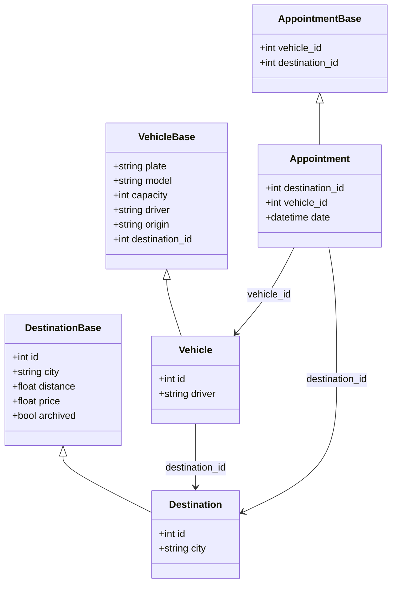

# Diseño de Modelos

## Diagrama de Modelos

## Detalles de los Modelos

### Destination
- Modelo para gestionar destinos de viaje
- **Atributos**:
  - `id`: Identificador único (PK)
  - `city`: Nombre de la ciudad destino
  - `distance`: Distancia en kilómetros
  - `price`: Precio del viaje
  - `archived`: Estado de archivo del destino

### Vehicle
- Modelo para gestionar vehículos
- **Atributos**:
  - `id`: Identificador único (PK)
  - `plate`: Placa del vehículo
  - `model`: Modelo del vehículo
  - `capacity`: Capacidad de pasajeros
  - `driver`: Nombre del conductor
  - `origin`: Ciudad de origen (default: "Bogotá")
  - `destination_id`: FK a Destination

### Appointment
- Modelo para gestionar citas/reservas
- **Atributos**:
  - `destination_id`: FK a Destination (PK)
  - `vehicle_id`: FK a Vehicle (PK)
  - `date`: Fecha y hora de la cita

## Relaciones

1. **Vehicle - Destination**
   - Un vehículo está asignado a un destino
   - Relación muchos a uno (N:1)

2. **Appointment - Vehicle/Destination**
   - Una cita conecta un vehículo con un destino
   - Relación muchos a muchos (N:M)
   - Incluye fecha y hora de la cita